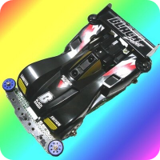
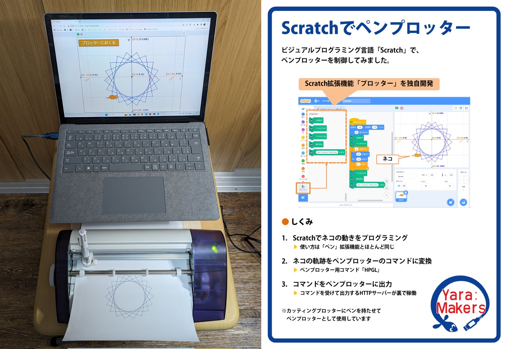
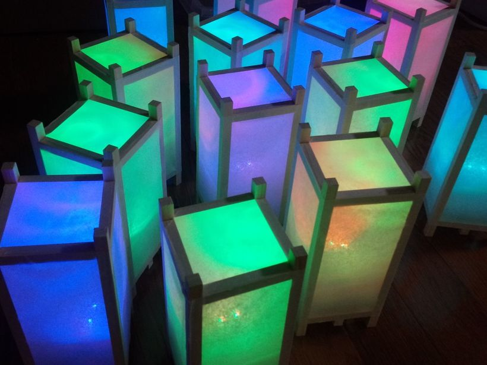

# テツオ(ktetsuo)'s Page

## プロフィール

浜松市在住の技術系会社員。「手段のためなら目的を選ばない」をモットーに、人生の様々な場面にものづくりを取り入れ、ライフワークとしてものづくりを楽しんでいます。メカ設計、電子工作、プログラミング等幅広く手を付けています。

### SNS等

* X: [@ktetsuo](https://twitter.com/ktetsuo)
* GitHub: [ktetsuo](https://github.com/ktetsuo/)

## 作品集

### 人生を制御するルーレット(2024年)

ボードゲームのルーレットを魔改造して、思い通りの数字を出せるようにしました。内蔵したDCモーターでブレーキをかけて停止位置を制御します。

[https://www.youtube.com/watch?v=KO91HQKmbec](https://www.youtube.com/watch?v=KO91HQKmbec)

### Scrathでペンプロッター(2023年)

ビジュアルプログラミング言語「Scratch」の拡張機能を開発し、USB接続のペンプロッター（カッティングプロッター）を制御できるようにしました。

### IoTおままごとキッチン(2020年)

娘のために、点火できるおままごとキッチンを作りました。ボリュームを回すと、LEDの火が灯ります。炎っぽくするために、1/fゆらぎをプログラミングしました。

https://protopedia.net/prototype/1877

[https://www.youtube.com/watch?v=6Xu61IOcya0](https://www.youtube.com/watch?v=6Xu61IOcya0)

### いないいないさあぼ(2018年)

「OK Google, いないいないばあして」と話すと、サーボモーターが動いて「いないいないばあ」をしてくれます。

[https://www.youtube.com/watch?v=Rwggodhm_F4](https://www.youtube.com/watch?v=Rwggodhm_F4)

### 結婚披露宴演出システム(2014年)

結婚披露宴を光で彩るLED行灯を自作し、実際に作者の結婚式で使用しました。「せーの」の声とともに魔法のステッキを振ると、各テーブルに１つずつ置いてある11個のLED行灯が七色に光輝きます。

https://fabble.cc/ktetsuo/weddingled

### プロトセイバーSTM(2010年)

ミニ四駆のプロトセイバーにSTM32マイコンを内蔵してライントレースカーにしました。

[https://www.youtube.com/watch?v=QVg7UyULcW0](https://www.youtube.com/watch?v=QVg7UyULcW0)

### ブラックセイバーAVR(2008年)

ミニ四駆のプロトセイバーにAVRマイコンを内蔵してライントレースカーにしました。

[https://www.youtube.com/watch?v=V_Oxi_zkYIA](https://www.youtube.com/watch?v=V_Oxi_zkYIA)

